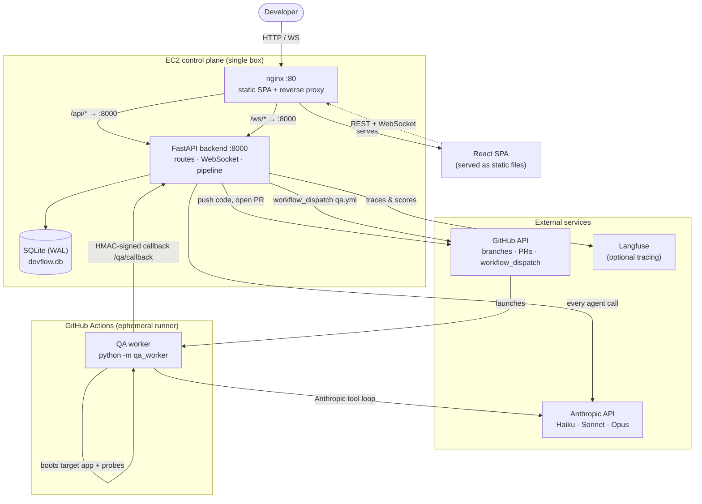
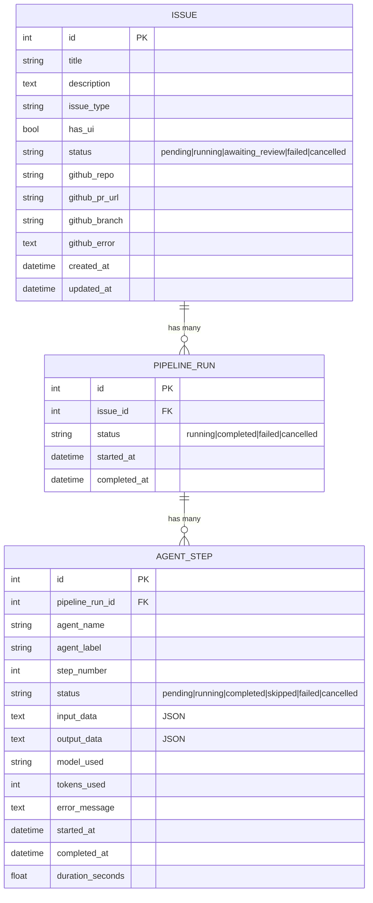
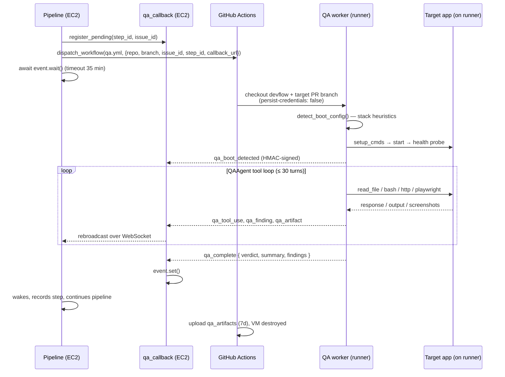
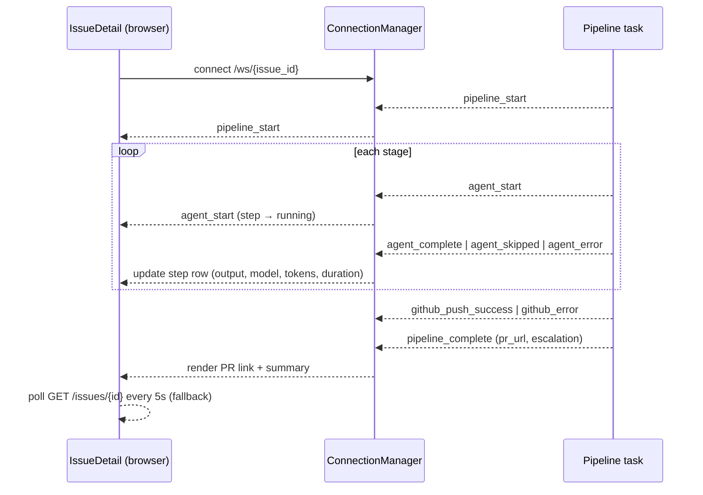
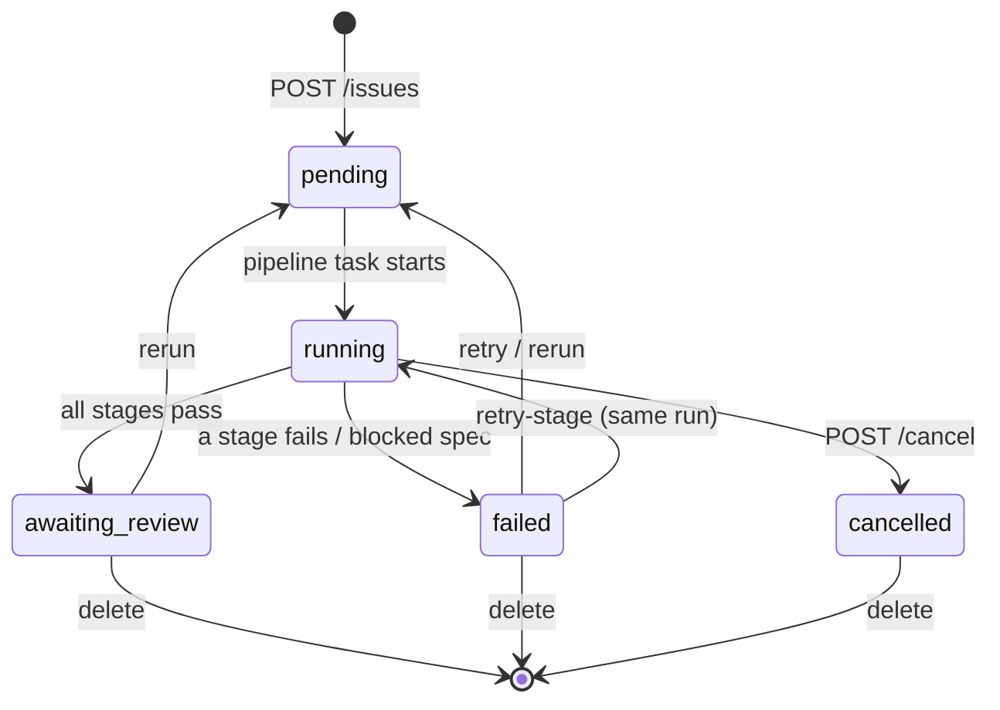
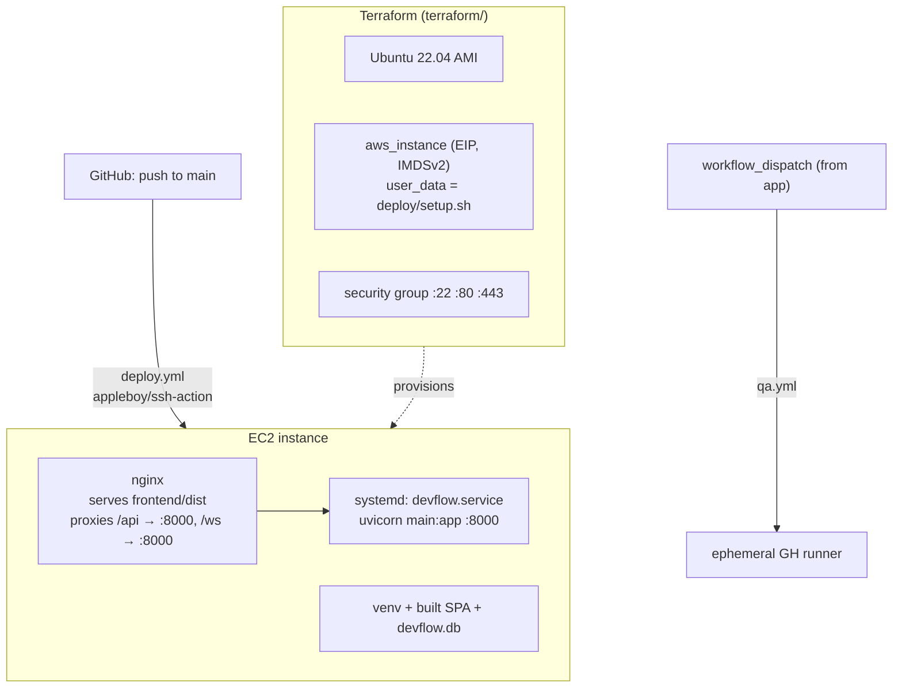

# DevFlow — Architecture

DevFlow is a **fully agentic developer pipeline**. A user files an issue through a web UI and a
chain of AI agents takes it from raw text all the way to an open pull request — normalising the
issue, writing an engineering spec, reviewing that spec, sizing the work, picking models, writing
the code, reviewing the code, QA-testing a running build, and finally producing a human-readable
escalation summary. Every step is streamed to the browser in real time.

This document explains the moving parts and how a request flows through them. Diagrams are written
in [Mermaid](https://mermaid.js.org/) and render natively on GitHub.

> The authoritative file-by-file reference lives in [`AGENTS.md`](../AGENTS.md). This document is the
> "how it fits together" companion.

---

## 1. System context

The control plane (FastAPI + React + SQLite) runs on a single EC2 box. It talks to three external
services: the **Anthropic API** (every agent), the **GitHub API** (branch/PR creation + dispatching
the QA workflow), and **Langfuse** (optional tracing). The QA stage is special — it runs *off* the
EC2 box inside a GitHub Actions runner and calls back over HTTP.



**Why QA runs off-box:** the QA agent boots the target PR's app and hammers it with adversarial HTTP
and Playwright probes. Running that on the production EC2 instance would be a security and resource
risk, so it is shipped to a throwaway GitHub Actions VM that is destroyed when the run ends. See
[§6](#6-qa-off-box-execution).

---

## 2. Component overview

| Layer | Tech | Key files |
|---|---|---|
| Frontend | React 18, React Router, Vite, Tailwind | `frontend/src/App.jsx`, `components/*`, `api/client.js` |
| API / orchestration | FastAPI (async), WebSocket manager | `backend/main.py` |
| Pipeline engine | Sequential stage executor | `backend/pipeline.py` |
| Agents | `BaseAgent` + Anthropic SDK | `backend/agents/*` |
| Persistence | SQLAlchemy ORM, SQLite (WAL) | `backend/database.py` |
| GitHub integration | PyGithub wrapper | `backend/github_client.py` |
| QA control plane | HMAC callback endpoint + async coordination | `backend/qa_callback.py` |
| QA worker (off-box) | Boot detector + tool-loop agent | `backend/qa_worker/*` |
| Observability | Langfuse traces & scores | `backend/observability.py` |
| Deploy / infra | GH Actions, nginx, systemd, Terraform | `.github/workflows/*`, `deploy/*`, `terraform/*` |

---

## 3. Data model

Three tables, cascade-deleted top-down. An **Issue** has many **PipelineRuns** (one per
run/retry/rerun); a run has many **AgentSteps** (one row per pipeline stage, plus extra rows for
revision loops).



All agent I/O is stored as JSON text in `input_data` / `output_data`. The DB is created via
`init_db()` in the FastAPI lifespan; SQLite runs in WAL mode for concurrent reads while a pipeline
writes.

---

## 4. The agent pipeline

When an issue is created, the API spawns a detached `asyncio` task that runs `Pipeline.run()`. Stages
execute **sequentially** in the order defined by `STAGE_ORDER`. Each stage reads from and writes to a
shared `context` dict, persists an `AgentStep`, and broadcasts WebSocket events. If any stage fails,
the pipeline halts and the issue is marked `failed`.

```mermaid
flowchart TD
    start([POST /issues]) --> intake

    intake["1 · Intake — Haiku<br/>normalise raw issue"] --> assessment
    assessment["2 · Assessment — Sonnet<br/>engineering spec<br/>(+ repo tree if GitHub repo)"] --> refreview
    refreview["3 · Refinement Review — Sonnet<br/>second-opinion on the spec"] --> refgate{ready_to_proceed?}

    refgate -->|no| fail([FAIL: spec blocked])
    refgate -->|yes| designgate{intake.requires_design_input?}

    designgate -->|yes| design["4 · Design Input — Sonnet<br/>UX/UI guidance"]
    designgate -->|no| designskip["4 · Design — SKIPPED"]
    design --> sizing
    designskip --> sizing

    sizing["5 · Sizing — Haiku<br/>XS / S / M / L / XL"] --> router
    router["6 · Model Router — deterministic<br/>size → coding & review model IDs"] --> coding

    coding["7 · Coding — router-selected model<br/>full implementation (files + tests)"] --> push{"GitHub configured<br/>and repo selected?"}
    push -->|yes| ghpush["push branch + open PR<br/>(non-fatal on error)"]
    push -->|no| skippush["skip push"]
    ghpush --> ciobserve
    skippush --> ciobserve

    ciobserve["8 · CI Observer<br/>poll GH Actions check runs"] --> cigate{"CI observation<br/>enabled & branch exists?"}
    cigate -->|no| ciskip["8 · CI Observer — SKIPPED"]
    cigate -->|"yes, success/no_checks"| prreview
    cigate -->|"yes, failure"| ciloop["fetch failing job logs<br/>→ coding_ci_revision_N<br/>→ update branch → re-poll CI<br/>(≤ CI_MAX_REVISIONS, default 5)"]
    ciloop -->|CI green| prreview
    ciloop -->|"still red after all revisions"| cifail([FAIL: CI never went green])
    ciskip --> prreview

    prreview["9 · PR Review — router-selected model<br/>verdict: APPROVE / COMMENT / REQUEST_CHANGES"] --> revgate{REQUEST_CHANGES?}
    revgate -->|"yes (≤ 2 revisions)"| revloop["coding_revision_N → update branch<br/>→ pr_review_revision_N"]
    revloop --> revgate
    revgate -->|no| qa

    qa["10 · QA Agent — off-box (GH Actions)<br/>boots app, adversarial probes"] --> qagate{"QA enabled & APPROVE<br/>& branch & configured?"}
    qagate -->|no| qaskip["10 · QA — SKIPPED"]
    qagate -->|"yes, QA_FAIL"| qaloop["coding_qa_revision → re-dispatch QA<br/>(≤ 1 revision)"]
    qaloop --> escalation
    qaskip --> escalation
    qa --> escalation

    escalation["11 · Escalation — Haiku<br/>human-readable summary"] --> done([Issue → awaiting_review])
```



### Stage notes

| # | Stage | Model | Notes |
|---|---|---|---|
| 1 | **Intake** | Haiku | Normalises the raw issue; emits `requires_design_input` which gates step 4. |
| 2 | **Assessment** | Sonnet | Produces the engineering spec. If a GitHub repo is attached, the repo tree is fetched first and injected as context. |
| 3 | **Refinement Review** | Sonnet | Second opinion on the spec. If `ready_to_proceed` is false, the pipeline **halts and fails** with the blocking reasons. |
| 4 | **Design Input** | Sonnet | UX/UI guidance — **skipped** unless intake set `requires_design_input`. |
| 5 | **Sizing** | Haiku | Complexity estimate `XS…XL`. |
| 6 | **Model Router** | *deterministic* | Not an LLM. `_resolve_models(size)` maps size → `(coding_model, review_model)` via a fixed routing table (Haiku/Sonnet/Opus by tier). Recorded as a `skipped` step that stores the routing result. |
| 7 | **Coding** | router-selected | Full implementation. Repo context (orientation files + spec's `key_files_to_read`) is fetched first. On success, pushes a branch and opens a PR (failures here are non-fatal and recorded in `github_error`). |
| 8 | **CI Observer** | router-selected (fix loop) | Polls GitHub Actions check runs on the pushed branch. Skipped unless `CI_OBSERVE_ENABLED`, GitHub is configured, and a branch exists. On failure, fetches the failing job's log tail and runs a coding-fix + re-poll loop (`CI_MAX_REVISIONS`, default 5). **If CI is still red once the loop is exhausted, the pipeline fails outright** — it will not hand a known-broken build to PR review. |
| 9 | **PR Review** | router-selected | Verdict `APPROVE` / `COMMENT` / `REQUEST_CHANGES`. On `REQUEST_CHANGES`, a revision loop (max 2) re-runs coding → updates the branch → re-reviews. |
| 10 | **QA** | Opus (off-box) | Dispatches `qa.yml`, awaits an async callback with the verdict. Skipped unless `QA_ENABLED`, PR review was `APPROVE`, a branch exists, and QA env vars are set. `QA_FAIL` triggers one coding+QA revision. See [§6](#6-qa-off-box-execution). |
| 11 | **Escalation** | Haiku | Human-readable wrap-up summary. |

On success the run is `completed` and the issue moves to `awaiting_review`; Langfuse receives the
final trace, scores (correctness/quality/security/etc. from PR review, plus QA verdict), and tags.

### Retry / re-run semantics

- `POST /issues/{id}/retry` and `/rerun` reset GitHub fields and run the whole pipeline from scratch
  on a **new** run.
- `POST /issues/{id}/retry-stage` calls `run_from_stage()` — it reuses outputs of completed stages
  before the retry point (rebuilding `context` from stored `output_data`), resets the failed/pending
  downstream steps, and resumes on the **same** run. Retrying at or before `coding` clears the GitHub
  PR/branch so a fresh PR is created.
- `POST /issues/{id}/cancel` cancels the running `asyncio` task; the issue and its running steps are
  marked `cancelled`.

---

## 5. Agent internals

Every agent (except the deterministic router and the off-box QA agent) extends `BaseAgent`:

```mermaid
flowchart LR
    ctx["context dict"] --> fmt["format_input(context)<br/>→ user message"]
    sys["get_system_prompt()<br/>→ system message"] --> call
    fmt --> call["Anthropic messages.create<br/>retry x2, backoff, 300s timeout"]
    call --> parse["parse_output(raw)<br/>strip fences, pick largest valid JSON"]
    parse --> out["{ output, raw_output, model,<br/>tokens_used, duration }"]
    call -.->|optional| lf["Langfuse generation<br/>(per-agent input/output/usage)"]
```

- **Default model** is Haiku; `CodingAgent` and `PRReviewAgent` accept a model override chosen by the
  router.
- `parse_output` is defensive: agents sometimes preface JSON with analysis prose, so it collects every
  fenced block and every balanced `{…}` group and returns the **largest** one that parses (the real
  implementation payload is always the biggest blob).
- Truncation (`stop_reason == max_tokens`) raises by default so incomplete output is never used
  downstream.

---

## 6. QA: off-box execution

The QA stage is the only agent that does **not** run on the EC2 control plane. The pipeline dispatches
a GitHub Actions workflow, then *blocks* on an `asyncio.Event` until the worker calls back with a
verdict. Coordination state lives in `qa_callback.py`, keyed by `step_id`.



Key points:

- **Auth:** every callback is HMAC-SHA256 signed with `QA_CALLBACK_SECRET` (shared between EC2 and the
  Actions secret) and verified in `_verify_signature`. Unknown/expired `step_id`s are dropped.
- **Boot detection** (`boot_detector.py`) heuristically figures out how to start the target app
  (root → `backend/` → `frontend/` → `apps/*`): setup commands, start command, port, health path.
- **The runner is the sandbox.** No nested Docker — the GH VM is ephemeral and destroyed after the run,
  and the checkout uses `persist-credentials: false` so the agent's `bash` tool can't exfiltrate the
  token from `.git/config`.
- **Verdict floor:** any `critical` or `major` finding forces `QA_FAIL` regardless of what the model
  claims in `finish`.
- **Timeout:** the pipeline waits `QA_WORKFLOW_TIMEOUT_SECONDS` (default 35 min), deliberately longer
  than the workflow's own 30-min cap, so a hung runner still resolves.

---

## 7. Real-time updates (WebSocket)

The detail page opens a WebSocket to `/ws/{issue_id}`. The pipeline broadcasts an event at every state
transition; QA callbacks are rebroadcast through the same channel. A 5s poll is the fallback if the
socket drops.



Event types emitted: `pipeline_start`, `pipeline_complete`, `pipeline_error`, `pipeline_cancelled`,
`agent_start`, `agent_complete`, `agent_skipped`, `agent_error`, `github_push_success`,
`github_error`, `github_skipped`, plus QA events (`qa_workflow_dispatched`, `qa_boot_detected`,
`qa_tool_use`, `qa_finding`, `qa_complete`).

---

## 8. Issue lifecycle



On startup, `_resume_interrupted_pipelines()` finds any issues left in `running` (e.g. the box
restarted mid-run), resets them to `pending`, and re-enqueues the pipeline task.

---

## 9. Deployment & infrastructure



- **`deploy.yml`** SSHes into the box on every push to `main`: writes `.env` from GitHub
  secrets/vars, `git pull`, installs backend deps, builds the frontend, and `systemctl restart
  devflow`.
- **`deploy/`** holds the `nginx.conf` (static SPA + `/api` and `/ws` reverse proxy), the
  `devflow.service` systemd unit, and `setup.sh` (run as EC2 `user_data`).
- **`terraform/`** provisions the instance, key pair, security group, and Elastic IP, with IMDSv2
  required and hop limit 1 to block credential theft via the metadata endpoint.

---

## 10. Configuration

| Variable | Required | Purpose |
|---|---|---|
| `ANTHROPIC_API_KEY` | Yes | All agent calls |
| `GH_TOKEN` / `GH_OWNER` | No | Enables branch/PR creation + workflow dispatch |
| `DATABASE_URL` | No | Defaults to `sqlite:///./devflow.db` |
| `FRONTEND_URL` | No | Extra CORS origin |
| `LANGFUSE_*` | No | Enables tracing/scoring |
| `QA_ENABLED` | No | Turns on the QA stage |
| `QA_WORKFLOW_REPO` | If QA | `owner/name` hosting `qa.yml` |
| `QA_CALLBACK_SECRET` | If QA | HMAC secret shared with the Actions secret |
| `PUBLIC_BASE_URL` | If QA | URL the GH runner uses to reach DevFlow |

---

## Quick map: "where does X live?"

- **Add/adjust a pipeline stage** → `backend/pipeline.py` (`STAGE_ORDER`, `_execute_stages`)
- **Change an agent's prompt/behaviour** → `backend/agents/<stage>.py`
- **Model routing table** → `_ROUTING_TABLE` / `_resolve_models` in `pipeline.py`
- **GitHub operations** → `backend/github_client.py`
- **QA worker logic** → `backend/qa_worker/` (`agent.py`, `runner.py`, `boot_detector.py`)
- **REST/WebSocket endpoints** → `backend/main.py`
- **UI** → `frontend/src/components/`
</content>
</invoke>
